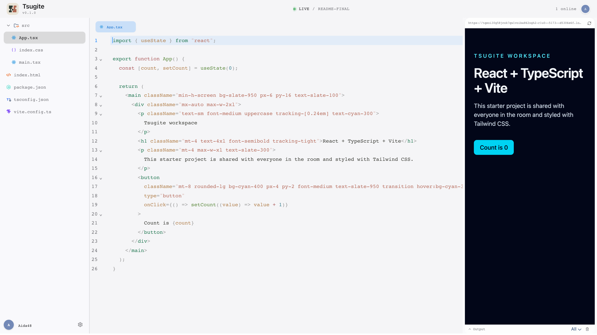
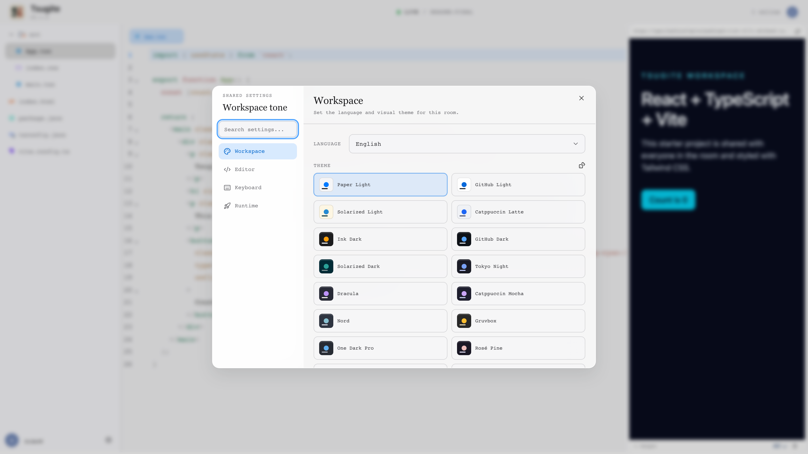

<p align="center">
  
</p>

<h1 align="center">Tsugite</h1>

<p align="center">A small, fast shared room for editing code together in the browser.</p>

<p align="center">
  <a href="https://github.com/BBboy01/Tsugite/actions/workflows/ci.yml"></a>
  <a href="https://github.com/BBboy01/Tsugite/actions/workflows/docker-publish.yml"></a>
  <a href="https://deepwiki.com/BBboy01/Tsugite"></a>
  <a href="https://github.com/BBboy01/Tsugite/commits/main"></a>
  <a href="https://github.com/BBboy01/Tsugite/issues"></a>
</p>

<p align="center">
  <a href="docs/getting-started.md">Get started</a> ·
  <a href="docs/deployment.md">Deploy</a> ·
  <a href="docs/architecture.md">Architecture</a>
</p>

<p align="center">
  
</p>

Tsugite is a collaborative code editor for small, shared rooms. Multiple people can edit the same project, follow each other's cursors, and see a live preview in the browser.

Each room starts with a React, TypeScript, Vite, and Tailwind project. The shared project document is synchronized with Loro CRDT. When a room contains a root `package.json`, each browser runs that project locally in WebContainer; the server never executes user project code.

## See it in action

The workspace keeps the file tree, editor, preview, output, and room presence in one place. Open the same room URL in another browser tab to see shared edits and presence update live.

<details>
<summary>Open the shared settings view</summary>

<p align="center">
  
</p>
</details>

## What it includes

- Shared files, settings, themes, fonts, cursors, and presence
- CodeMirror 6 editor with Vim mode, relative line numbers, fuzzy file search, and configurable keymaps
- Browser-local live previews with incremental file synchronization and runtime recovery actions
- Anonymous room identities with editable display names and avatar colors
- Docker Compose deployment with Caddy serving the web app and proxying WebSocket traffic

## A typical session

1. Share a room URL with a teammate.
2. Edit files together and use the presence indicators to see who is active.
3. Follow a collaborator when you need to watch their cursor and selection.
4. Run the project locally in each browser and inspect the live preview or output panel.
5. Use fuzzy file search, Vim mode, or keymaps when the project grows beyond a few files.

## Quick start

Requirements:

- [Bun](https://bun.sh/) matching [`.bun-version`](.bun-version)
- A browser that supports cross-origin isolation and WebContainer

Install dependencies, then start each development process in a separate terminal:

```bash
bun install
bun run dev:server
bun run dev:web
```

Open [http://127.0.0.1:5173/room/demo](http://127.0.0.1:5173/room/demo) in two browser tabs to try collaboration.

## Documentation

- [Getting started](docs/getting-started.md): first run, room usage, and browser requirements
- [Development guide](docs/development.md): repository layout, local workflows, and verification
- [Deployment guide](docs/deployment.md): Docker Compose, Caddy, images, and configuration
- [Architecture](docs/architecture.md): runtime boundaries, data flow, and failure boundaries
- [Contributing](CONTRIBUTING.md): commits, pull requests, releases, and dependency updates

## Verification

Run the checks that match the change before opening a pull request:

```bash
bun run test
bun run lint
bun run format:check
bun run knip
bun run build
bun run test:e2e
```

Playwright automatically starts the web and server processes, or reuses running local instances. The GitHub Actions browser workflow runs Playwright smoke tests for release candidates, version tags, and manual runs.

## Current limitations

- Room documents are stored in memory by the Bun server. Restarting the server resets rooms.
- Room access is based on the room URL; there is no authentication or authorization layer yet.
- Project dependencies and preview processes run independently in each collaborator's browser.
- A project without a root `package.json` uses the single-file Babel iframe fallback instead of WebContainer.
