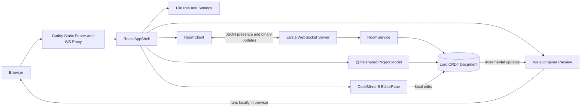

# Tsugite Architecture

## Runtime Boundaries

- `apps/web` owns UI state, CodeMirror lifecycle, local WebContainer execution, and browser persistence.
- `apps/server` owns room membership, presence relay, and in-memory Loro documents. It does not execute project code.
- `packages/shared` defines the project model, settings, protocol messages, and CRDT helpers used by both sides.
- Caddy serves the built web app, proxies `/ws/*`, and supplies the cross-origin isolation headers required by WebContainer.

## Update Paths

Document updates increment the document revision and refresh files, settings, editor content, and preview inputs. Presence and connection updates use a separate revision so cursor movement does not invalidate document-derived data. Editor-local high-frequency work should remain inside CodeMirror extensions and avoid rebuilding full-document structures when the viewport or active line is unchanged.
