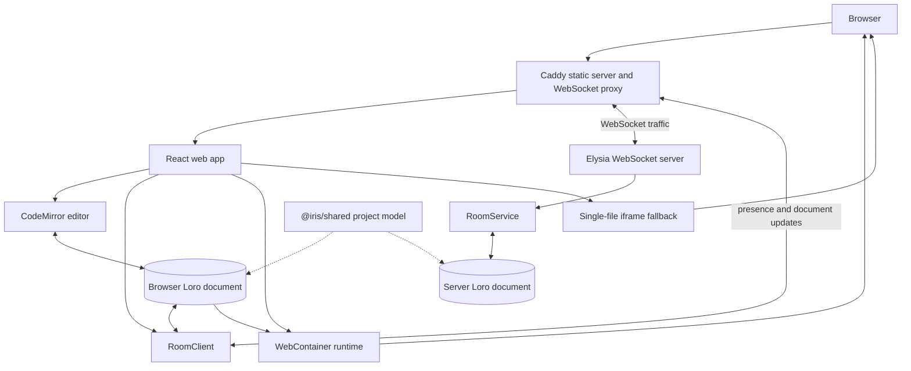

# Architecture

Tsugite is a browser-first collaborative editor. The server synchronizes room state, while every browser owns its editor, preview runtime, and presentation of that state.

## System overview

## Ownership

| Area              | Owner                | Responsibility                                                                                |
| ----------------- | -------------------- | --------------------------------------------------------------------------------------------- |
| `apps/web`        | Browser              | UI state, CodeMirror lifecycle, local settings, WebContainer, preview iframe                  |
| `apps/server`     | Bun process + SQLite | Room membership, presence relay, validation, in-memory Loro documents and persisted snapshots |
| `packages/shared` | Both                 | Project files, folders, settings, protocol messages, CRDT helpers                             |
| Caddy             | Deployment           | Static files, SPA fallback, WebSocket proxy, cross-origin isolation headers                   |

The server never runs a user's project commands. Dependency installation and preview servers run inside each collaborator's browser.

## Data flow

### Room bootstrap

1. The browser opens `/room/<room-id>` and creates or loads the anonymous local identity.
2. `RoomClient` connects to the server and requests the room snapshot.
3. `RoomService` returns the Loro document state and current presence.
4. The web app derives files, folders, settings, and active collaborators from the shared model.

### Editing and synchronization

1. CodeMirror produces a local text update.
2. The shared project helper applies the update to the Loro document.
3. `RoomClient` sends the binary document update to the server.
4. The server broadcasts it to the other room members.
5. Each browser derives the changed file and incrementally syncs its local preview runtime.

Presence and cursor updates use a separate high-frequency path. They should not rebuild full project structures or invalidate preview inputs.

### Preview selection

- A root `package.json` selects WebContainer.
- The runtime mounts the project, installs dependencies when enabled, and starts `scripts.dev` or `scripts.start`.
- Source changes are written incrementally to the local container.
- Package metadata changes restart the local preview process.
- A syntax error is reported in the preview surface without destroying the runtime.
- Without `package.json`, the selected source is transpiled into a single-file iframe fallback.

## Persistence

- Room snapshots are stored in SQLite through Drizzle ORM. The snapshot contains the complete Loro project document: files, folders, and workspace settings.
- The active Loro document remains in memory for low-latency collaboration and is saved after accepted document updates.
- Presence, cursors, follow mode, WebContainer dependencies, and preview processes are intentionally not persisted.
- Docker mounts `/data` as the `tsugite-data` volume. Set `DATABASE_PATH` when running the server outside Docker.

## Failure boundaries

- Database loss or an unavailable database prevents room recovery, while presence remains connection-scoped.
- Network interruption pauses synchronization but must not corrupt the local editor document.
- WebContainer capability or browser policy failures are surfaced as preview runtime errors.
- Preview process failures are local to a browser and do not affect collaboration state.

## Extension guidelines

- Put shared data shape changes in `packages/shared` first.
- Keep transport concerns in `RoomClient` and `RoomService`; do not leak WebSocket details into UI components.
- Keep preview lifecycle transitions inside `WebContainerRuntime` and expose typed runtime events.
- Add a focused unit test for pure transformations and a Playwright regression for timing-sensitive UI or preview behavior.
