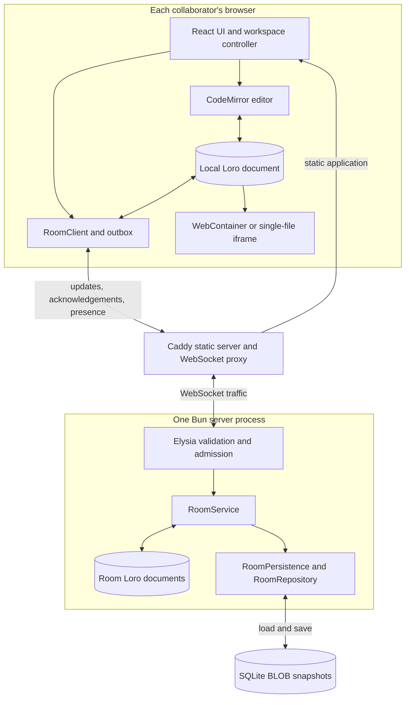
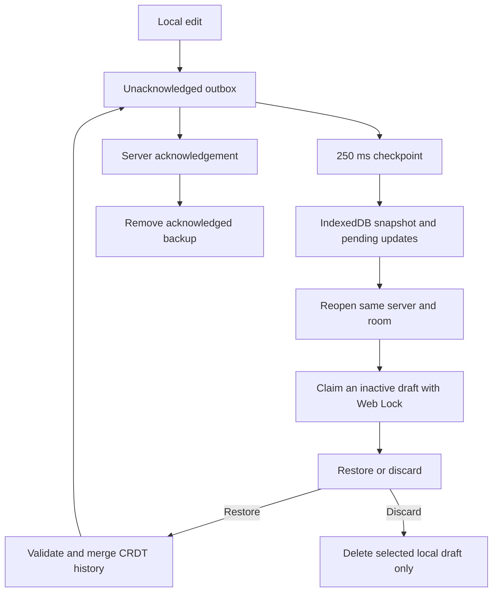
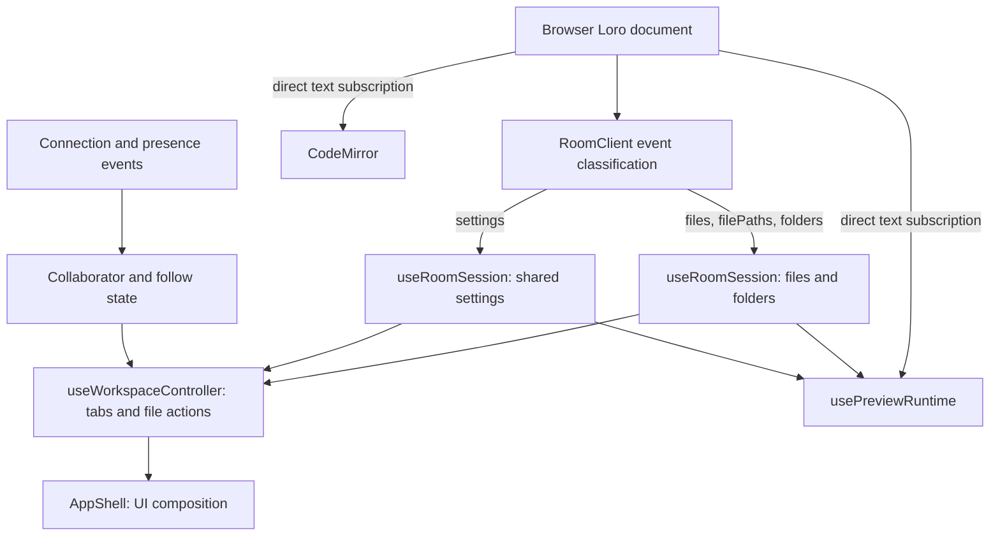
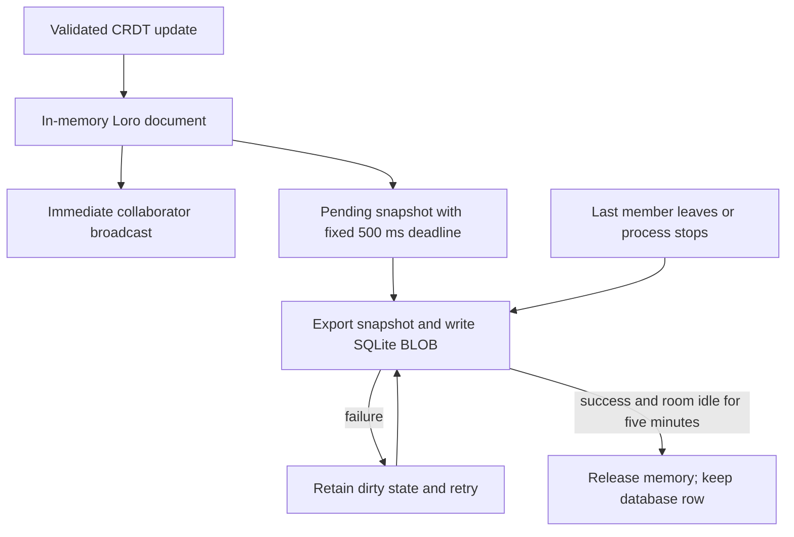

# Architecture

[Documentation home](../README.md#documentation) · [Development](development.md) · [Deployment](deployment.md)

Tsugite is a browser-first collaborative editor. The server synchronizes room state, while every browser owns its editor, preview runtime, and presentation of that state.

## System overview

## Ownership

| Area              | Owner                | Responsibility                                                                                |
| ----------------- | -------------------- | --------------------------------------------------------------------------------------------- |
| `apps/web`        | Browser              | UI state, CodeMirror lifecycle, local settings, WebContainer, preview iframe                  |
| `apps/server`     | Bun process + SQLite | Room membership, presence relay, validation, in-memory Loro documents and persisted snapshots |
| `packages/shared` | Both                 | Project files, folders, settings, protocol messages, CRDT helpers                             |
| Caddy             | Deployment           | Static files, SPA fallback, WebSocket proxy, cross-origin isolation headers                   |

The server never runs a user's project commands. Dependency installation and preview servers run inside each collaborator's browser.

`@iris/shared` defines project containers, settings, and protocol messages for both processes. Room state and presence are coordinated by one server process; SQLite persistence alone does not make multiple replicas consistent. See [deployment boundaries](deployment.md#operational-boundaries).

### Source map

| Responsibility                              | Entry point                                                                                                                                  |
| ------------------------------------------- | -------------------------------------------------------------------------------------------------------------------------------------------- |
| UI composition                              | [app-shell.tsx](../apps/web/src/app-shell.tsx)                                                                                               |
| Room subscriptions and invalidation         | [use-room-session.ts](../apps/web/src/lib/use-room-session.ts)                                                                               |
| Tabs, follow state, shortcuts, file actions | [use-workspace-controller.ts](../apps/web/src/lib/use-workspace-controller.ts)                                                               |
| Transport and replay                        | [room-client.ts](../apps/web/src/lib/room-client.ts), [room-outbox.ts](../apps/web/src/lib/room-outbox.ts)                                   |
| Preview subscriptions and lifecycle         | [use-preview-runtime.ts](../apps/web/src/lib/use-preview-runtime.ts), [webcontainer-runtime.ts](../apps/web/src/lib/webcontainer-runtime.ts) |
| WebSocket admission and messages            | [room-app.ts](../apps/server/src/room-app.ts)                                                                                                |
| Room lifetime and persistence scheduling    | [room-service.ts](../apps/server/src/rooms/room-service.ts), [room-persistence.ts](../apps/server/src/rooms/room-persistence.ts)             |
| SQLite initialization and storage           | [database.ts](../apps/server/src/db/database.ts), [room-repository.ts](../apps/server/src/rooms/room-repository.ts)                          |

## Data flow

### Room bootstrap

1. The browser opens `/room/<room-id>` and creates or loads the anonymous local identity.
2. `RoomClient` connects to `/ws/<room-id>` and sends a JSON `join` message with its identity.
3. `RoomService` loads or creates the room and sends `ready`, a binary Loro snapshot, and `presence:list`.
4. The web app derives files, folders, settings, and active collaborators from the shared model.

### Editing and synchronization

1. CodeMirror produces a local text update.
2. The shared project helper applies the update to the Loro document.
3. `RoomClient` queues the binary document update through `RoomOutbox`, sharing a bounded sending budget with presence messages.
4. The server imports the update, broadcasts it to the other room members, and returns `update:ack` to its sender.
5. Each browser derives the changed file and incrementally syncs its local preview runtime.

The outbox retains updates until acknowledgement, replays unacknowledged updates after reconnect, and coalesces queued presence messages to their latest value. Loro imports are idempotent, so replay after a lost acknowledgement does not duplicate edits. The sending budget includes the join message and prevents offline catch-up from exceeding the server's message-rate limit. An acknowledgement means the server accepted the update into memory, not that the snapshot has reached SQLite.

JSON carries join, presence, ready, and acknowledgement messages; binary frames carry Loro updates or snapshots. Acknowledgements release pending updates in WebSocket order. Only the active socket can change client state. The `live` indicator describes the connection, not an empty outbox or a successful database flush. Frontend and backend must use the same protocol version; mixed-version rolling deployments are unsupported.

Presence and cursor updates use a separate state-invalidation path but the same transport budget. They should not rebuild full project structures or invalidate preview inputs.

### Local draft recovery

`RoomDrafts` observes outbox changes independently of workspace invalidation. While updates remain pending, it checkpoints a binary Loro snapshot and the exact pending update queue to `tsugite-drafts` in IndexedDB. A fixed 250 ms deadline coalesces rapid edits; serialized transactions prevent an older write from overtaking an acknowledgement cleanup. Only transaction completion means the checkpoint is saved.

Each mounted room session has a unique draft ID and holds its Web Lock. Drafts are scoped by the resolved server WebSocket URL, including room ID, inside the browser origin. Recovery claims only unlocked records and re-reads them after obtaining the lock, so active tabs and simultaneous recovery dialogs cannot overwrite or claim one another's data.

Recovery does not import or transmit the old snapshot before explicit consent. It validates bytes in a temporary Loro document, merges history instead of replacing file strings, and replays pending updates through the existing bounded outbox. The original draft remains until its replacement checkpoint succeeds or the updates are acknowledged. A leftover draft already covered by the received room snapshot can be removed without asking. Corrupt or incompatible records remain available for explicit discard; failed restoration does not silently erase the stored copy.

The recovery dialog uses the existing theme and Radix focus trap. If merging succeeds but saving the replacement fails, it offers a backup retry and disables discard until the original copy is safely replaced. Retrying does not enqueue the same updates again. Backup state updates are separate from presence and document updates; unchanged backup states do not cause React renders. No extra database dependency or server protocol is introduced.

### Frontend invalidation ownership

`RoomClient` classifies each Loro event batch by its changed root containers. Mixed batches can invalidate more than one category. `useRoomSession` only rebuilds workspace metadata or shared settings when their corresponding category changes; text-only updates do not trigger its React state setters.

The preview owns its text subscriptions, so removing broad AppShell invalidations does not suppress local or remote preview updates. Workspace metadata remains stable while file text changes. Preview file synchronization is debounced separately from collaboration transport.

Vim search maps existing decorations during edits and schedules one recount after 100 ms without postponing it on every keystroke. Query changes and explicit navigation refresh immediately. This reduces repeated scans; it does not cap the exact match count or change its linear recount cost.

### Preview selection

- A root `package.json` selects WebContainer.
- The runtime mounts the project, installs dependencies when enabled, and starts `scripts.dev` or `scripts.start`.
- Source changes are written incrementally to the local container.
- Package metadata changes restart the local preview process.
- A syntax error is reported in the preview surface without destroying the runtime.
- Without `package.json`, the selected source is transpiled into a single-file iframe fallback.
- Single-file previews use an opaque-origin script sandbox and cannot access the application's storage or parent DOM. WebContainer previews retain their separate-origin runtime permissions.
- JavaScript and TypeScript source preflight applies only to script extensions; HTML, CSS, JSON and other resources are checked by the project runtime.

The starter manifest is pinned for new rooms. A compatibility transform can adjust the browser-mounted manifest of an older Vite room without changing its shared source. Explicit project overrides take precedence. Runtime restart reuses the container and restarts its process; reinstall additionally forces the package-manager install step. Neither action is a room-server restart.

## Persistence

- Room snapshots are stored in SQLite through Drizzle ORM. The snapshot contains the complete Loro project document: files, folders, and workspace settings.
- The active Loro document remains in memory for low-latency collaboration and is saved after accepted document updates.
- Accepted updates are relayed immediately. The first dirty update schedules a binary snapshot save after 500 ms; subsequent edits share that deadline instead of postponing it.
- New writes use a SQLite BLOB. Legacy JSON snapshots remain readable and are replaced on the next successful save.
- The last member leaving flushes the snapshot immediately. Empty rooms are evicted from memory after five minutes, but their database rows remain available for reconnects.
- Failed saves retain dirty state and retry. A room with unsaved changes cannot be evicted. Repeated failures for the same pending save are logged once.
- SIGTERM and SIGINT stop new mutations and flush pending snapshots. Shutdown retries failed saves for up to five seconds and exits unsuccessfully if persistence still fails.
- Presence, cursors, follow mode, WebContainer dependencies, and preview processes are intentionally not persisted.
- Docker mounts `/data` as the `tsugite-data` volume. Set `DATABASE_PATH` when running the server outside Docker.

| State                                                                             | Lifetime and storage                                                       |
| --------------------------------------------------------------------------------- | -------------------------------------------------------------------------- |
| File contents, paths, empty folders, shared settings                              | Loro snapshot in SQLite                                                    |
| Identity, interface language, Vim preference, keymap, system-clipboard preference | Browser local storage, scoped to origin                                    |
| Unacknowledged updates                                                            | Browser memory plus best-effort IndexedDB checkpoint until acknowledgement |
| Cursors and active-file presence                                                  | Live room connections                                                      |
| Open tabs, selection, follow state, undo history                                  | Current editor session                                                     |
| Installed project dependencies and preview processes                              | Each browser's WebContainer runtime                                        |

## Failure boundaries

- Startup or migration failure prevents the server from starting. Save failures after startup retain dirty room state and retry, but a process crash can still lose that unsaved state.
- Network interruption pauses synchronization but must not corrupt the local editor document.
- An encoded local update above 1 MiB stops synchronization and exposes an offline error. A completed local draft checkpoint can recover its content, but restoring it does not bypass the transport limit or resume synchronization. Copy the content and reapply it as smaller edits.
- Browser draft storage is best-effort recovery, not a server backup: quota/privacy failures are visible, and browser eviction or termination before transaction completion can lose recent edits. Unsupported Web Locks disables local backup rather than risking concurrent writers. Existing unload protection remains active for unacknowledged edits.
- WebContainer capability or browser policy failures are surfaced as preview runtime errors.
- Preview process failures are local to a browser and do not affect collaboration state.
- Dependency installation has a two-minute deadline. Exceeding it terminates the install process and reports an installation failure, not a browser capability failure.
- Anonymous room IDs and claimed identities are not authentication. Input and rate limits bound some resource use, but do not enforce ownership, authorization, total document memory, or disk quotas.

## Extension guidelines

- Put shared data shape changes in `packages/shared` first.
- Keep transport concerns in `RoomClient` and `RoomService`; do not leak WebSocket details into UI components.
- Keep preview lifecycle transitions inside `WebContainerRuntime` and expose typed runtime events.
- Add a focused unit test for pure transformations and a Playwright regression for timing-sensitive UI or preview behavior.

## Browser test ownership

The Playwright suite uses a dedicated in-memory room server on port 3003 and a Vite server on port 5175, without loading environment files or reusing development servers. The test server permits larger test-room batches; production admission limits remain unchanged.

The `ui` project runs ordinary browser scenarios with up to two local workers. After it passes, the `preview` project runs WebContainer startup and recovery scenarios with one worker, avoiding overlap with the UI batch. Use `--project=preview --no-deps` for an isolated preview diagnosis. A dependency failure prevents that dependent project from running and must not be reported as a passing preview check.

Browser CI remains reserved for release candidates, version tags and manual runs. Unit checks do not establish that remote WebContainer services or dependency downloads work in a real browser. Commands and test ownership are documented in the [development guide](development.md#test-data-and-browser-tests).
