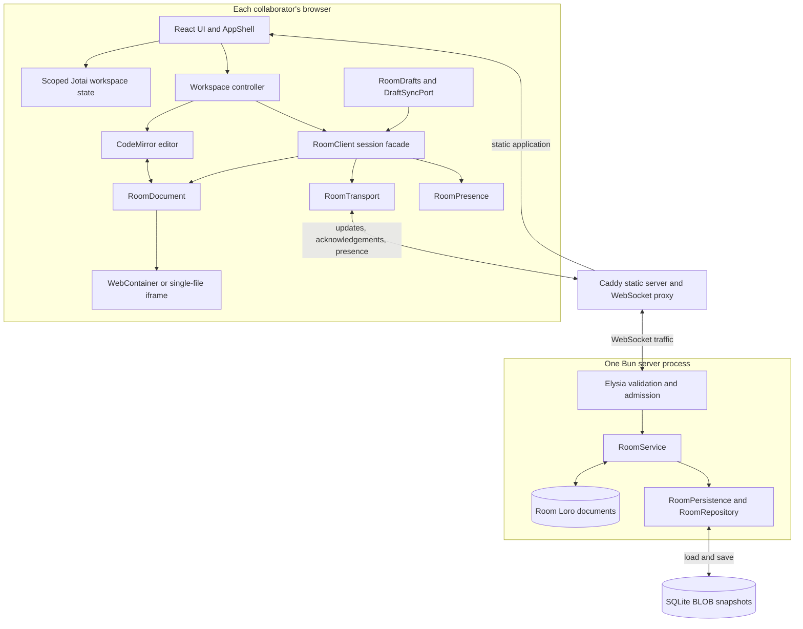
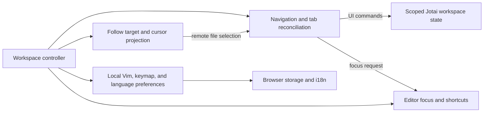
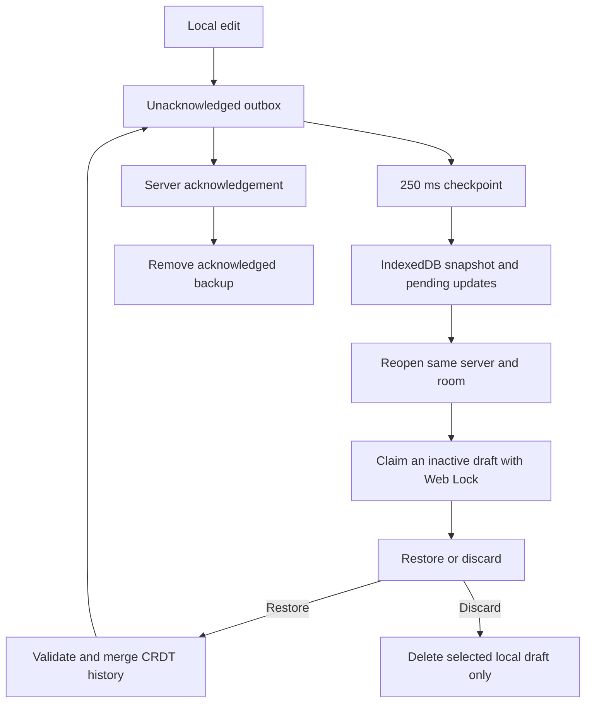
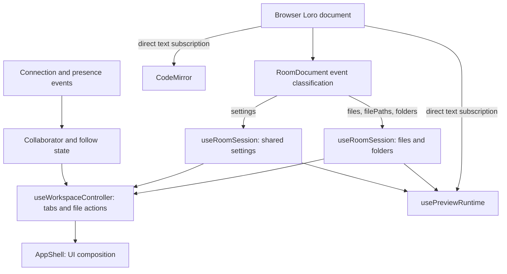
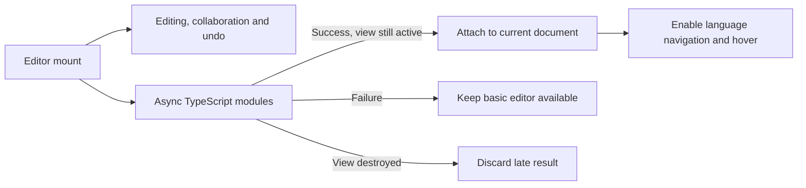
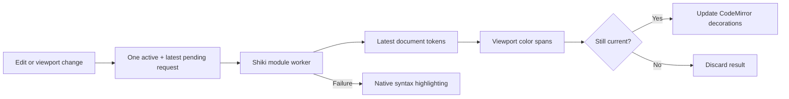
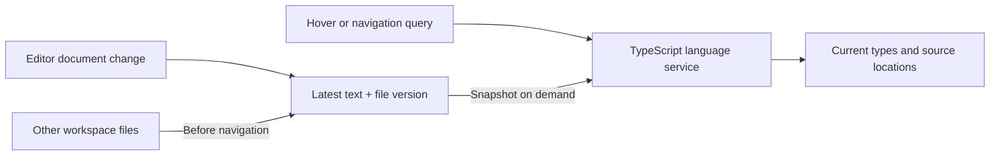
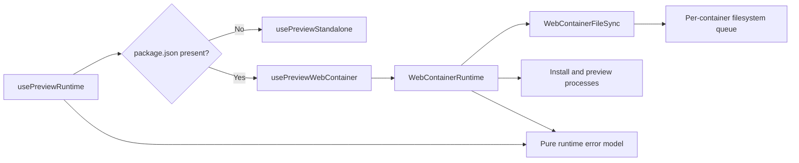
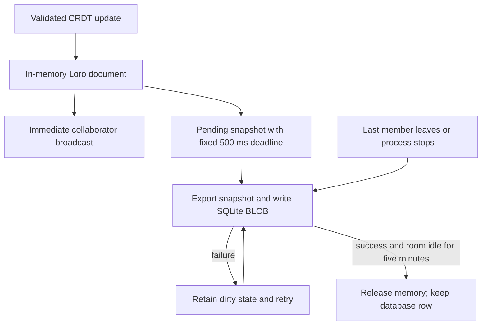

# Architecture

[Documentation home](../README.md#documentation) · [Development](development.md) · [Deployment](deployment.md)

Tsugite is a browser-first collaborative editor. The server synchronizes room state, while every browser owns its editor, preview runtime, and presentation of that state.

## System overview

```mermaid
flowchart TB
  subgraph Browser["Each collaborator's browser"]
    Web["React UI and AppShell"]
    Workspace["Scoped Jotai workspace state"]
    Editor["CodeMirror editor"]
    Controller["Workspace controller"]
    Session["RoomClient session facade"]
    Transport["RoomTransport"]
    Document["RoomDocument"]
    Presence["RoomPresence"]
    Drafts["RoomDrafts and DraftSyncPort"]
    Preview["WebContainer or single-file iframe"]
    Web --> Workspace
    Web --> Controller
    Controller --> Editor
    Controller --> Session
    Editor <--> Document
    Session --> Transport
    Session --> Document
    Session --> Presence
    Drafts --> Session
    Document --> Preview
  end
  Proxy["Caddy static server and WebSocket proxy"]
  subgraph Backend["One Bun server process"]
    Server["Elysia validation and admission"]
    Room["RoomService"]
    ServerDocument[("Room Loro documents")]
    Persistence["RoomPersistence and RoomRepository"]
    Server --> Room
    Room <--> ServerDocument
    Room --> Persistence
  end
  Database[("SQLite BLOB snapshots")]
  Proxy -->|static application| Web
  Transport <-->|updates, acknowledgements, presence| Proxy
  Proxy <-->|WebSocket traffic| Server
  Persistence <-->|load and save| Database
```

## Ownership

| Area              | Owner                | Responsibility                                                                                |
| ----------------- | -------------------- | --------------------------------------------------------------------------------------------- |
| `apps/web`        | Browser              | Scoped UI state, CodeMirror lifecycle, local settings, WebContainer, preview iframe           |
| `apps/server`     | Bun process + SQLite | Room membership, presence relay, validation, in-memory Loro documents and persisted snapshots |
| `packages/shared` | Both                 | Project files, folders, settings, protocol messages, CRDT helpers                             |
| Caddy             | Deployment           | Static files, SPA fallback, WebSocket proxy, cross-origin isolation headers                   |

The server never runs a user's project commands. Dependency installation and preview servers run inside each collaborator's browser.

`@iris/shared` defines project containers, settings, and protocol messages for both processes. Room state and presence are coordinated by one server process; SQLite persistence alone does not make multiple replicas consistent. See [deployment boundaries](deployment.md#operational-boundaries).

### Source map

| Responsibility                              | Entry point                                                                                                                                                                                                                                |
| ------------------------------------------- | ------------------------------------------------------------------------------------------------------------------------------------------------------------------------------------------------------------------------------------------ |
| UI composition                              | [app-shell.tsx](../apps/web/src/app-shell.tsx)                                                                                                                                                                                             |
| Room subscriptions and invalidation         | [use-room-session.ts](../apps/web/src/lib/use-room-session.ts)                                                                                                                                                                             |
| Workspace state and commands                | [workspace-state.ts](../apps/web/src/lib/workspace-state.ts), [workspace-atoms.ts](../apps/web/src/lib/workspace-atoms.ts)                                                                                                                 |
| Tabs, follow state, file actions            | [use-workspace-controller.ts](../apps/web/src/lib/use-workspace-controller.ts)                                                                                                                                                             |
| File-tree rows and inline actions           | [file-tree.tsx](../apps/web/src/components/file-tree.tsx), [file-tree-row.tsx](../apps/web/src/components/file-tree-row.tsx), [file-tree-inline-controls.tsx](../apps/web/src/components/file-tree-inline-controls.tsx)                    |
| File and command search                     | [file-fuzzy-search.ts](../apps/web/src/lib/file-fuzzy-search.ts), [command-palette-model.ts](../apps/web/src/lib/command-palette-model.ts), [settings-registry.ts](../apps/web/src/lib/settings-registry.ts)                               |
| Focus and shortcuts                         | [use-editor-focus.ts](../apps/web/src/lib/use-editor-focus.ts), [use-workspace-shortcuts.ts](../apps/web/src/lib/use-workspace-shortcuts.ts)                                                                                               |
| Workspace shortcut model                    | [keymap.ts](../apps/web/src/lib/keymap.ts), [use-workspace-shortcuts.ts](../apps/web/src/lib/use-workspace-shortcuts.ts)                                                                                                                   |
| Navigation reconciliation                   | [use-workspace-navigation.ts](../apps/web/src/lib/use-workspace-navigation.ts), [workspace-navigation.ts](../apps/web/src/lib/workspace-navigation.ts)                                                                                     |
| Follow projection                           | [use-workspace-follow.ts](../apps/web/src/lib/use-workspace-follow.ts), [workspace-follow.ts](../apps/web/src/lib/workspace-follow.ts)                                                                                                     |
| Local editor preferences                    | [workspace-preferences.ts](../apps/web/src/lib/workspace-preferences.ts)                                                                                                                                                                   |
| Localization resources and initialization   | [i18n.ts](../apps/web/src/lib/i18n.ts), [i18n-en.ts](../apps/web/src/lib/i18n-en.ts), [i18n-zh-cn.ts](../apps/web/src/lib/i18n-zh-cn.ts), [i18n-zh-tw.ts](../apps/web/src/lib/i18n-zh-tw.ts), [i18n-ja.ts](../apps/web/src/lib/i18n-ja.ts) |
| Editor lifecycle and visual reconfiguration | [editor-pane.tsx](../apps/web/src/components/editor-pane.tsx); CodeMirror compartments keep theme, wrapping, and Shiki updates in one editor instance                                                                                      |
| Incremental visual settings                 | [editor-visual-configuration.ts](../apps/web/src/lib/editor-visual-configuration.ts)                                                                                                                                                       |
| Vim integration lifecycle                   | [editor-vim-bindings.ts](../apps/web/src/lib/editor-vim-bindings.ts)                                                                                                                                                                       |
| Optional TypeScript services                | [editor-typescript-services.ts](../apps/web/src/lib/editor-typescript-services.ts)                                                                                                                                                         |
| Session, transport and replay               | [room-client.ts](../apps/web/src/lib/room-client.ts), [room-transport.ts](../apps/web/src/lib/room-transport.ts), [room-outbox.ts](../apps/web/src/lib/room-outbox.ts)                                                                     |
| Document and presence boundaries            | [room-document.ts](../apps/web/src/lib/room-document.ts), [room-presence.ts](../apps/web/src/lib/room-presence.ts)                                                                                                                         |
| Preview mode composition and iframe events  | [use-preview-runtime.ts](../apps/web/src/lib/use-preview-runtime.ts)                                                                                                                                                                       |
| Standalone preview compilation lifecycle    | [use-preview-standalone.ts](../apps/web/src/lib/use-preview-standalone.ts)                                                                                                                                                                 |
| WebContainer React lifecycle                | [use-preview-webcontainer.ts](../apps/web/src/lib/use-preview-webcontainer.ts), [webcontainer-runtime.ts](../apps/web/src/lib/webcontainer-runtime.ts)                                                                                     |
| WebSocket admission and messages            | [room-app.ts](../apps/server/src/room-app.ts)                                                                                                                                                                                              |
| Room lifetime and persistence scheduling    | [room-service.ts](../apps/server/src/rooms/room-service.ts), [room-persistence.ts](../apps/server/src/rooms/room-persistence.ts)                                                                                                           |
| SQLite initialization and storage           | [database.ts](../apps/server/src/db/database.ts), [room-repository.ts](../apps/server/src/rooms/room-repository.ts)                                                                                                                        |

Workspace state is scoped to the application provider. Components subscribe to individual selectors instead of the full workspace object; modal visibility is read by each modal, so opening a search or command palette does not rerender the editor and preview tree.

`workspaceCommandAtom` is the UI command boundary. Its TypeScript signature
remains a closed command union, and runtime validation rejects unknown commands
or malformed payloads before calling the pure reducer. Rejected commands leave
the store unchanged and emit a payload-free warning only in development. Empty
file selections, explicit `false`, and nullable follow/panel targets retain their
existing meanings. This is an internal UI contract, not a network or persisted
command format; protocol and storage decoding remain at their own boundaries.

The workspace controller composes navigation, follow behavior, local preferences,
focus, and shortcut hooks. Navigation reconciles renamed paths by stable file ID
and removes deleted tabs; an explicitly empty selection remains empty, including
when following a collaborator with no active file. Activating a file locally exits
follow mode, while selecting the followed file does not. Pending cursor sends are
cancelled before file selection so a cursor cannot be published for the old file.

Controller actions are memoized at the composition boundary, and the file tree,
editor, preview, file search, and command palette use shallow prop boundaries.
Presence or connection updates therefore do not recreate unrelated action props or
re-run unchanged feature trees. File content, shared settings, active tabs, and
followed selections remain explicit prop changes that invalidate the feature that
owns them. The file tree virtualizes its visible rows and keeps active, edited, and
context-menu targets mounted; `e2e/file-tree-performance.spec.ts` records mount
cost and verifies that a 5,000-file tree stays bounded in rendered row count.

Current-user name and color cross the memoized file-tree boundary as scalar
props. The session identity object is mutable, so passing its stable reference
would hide profile updates from React's shallow comparison.

File actions share the `FileTreeTarget` contract from `file-tree-model.ts` rather
than importing UI component types. `FileTree` owns local inline-edit, collapse,
and confirmation state; `FileTreeNodes` owns virtualization and keyboard
navigation; `FileTreeContextMenu` renders actions and captures the delete item's
anchor before the menu closes. Inline editing and deletion confirmation start
from the menu's close-auto-focus callback and suppress its default focus
restoration so the new control can receive focus. These transient interactions
do not enter Jotai or the collaborative document.

Tree row and keyboard handlers accept only events from their own DOM subtree.
Delete confirmation is rendered in a portal: its React events must not activate
the underlying row, toggle a folder, or replace the post-deletion selection.
Closing the active editor tab requests focus through the navigation hook after
the atomic tab transition; DOM side effects remain outside the state reducer.
Theme preview is cleared whenever the command palette closes, including when
another workspace dialog replaces it without calling its local close handler.

The Command Palette model builds its root actions and searchable setting
submenus from the current room settings, local Vim and clipboard preferences,
and workspace keymap. Theme hover or keyboard selection updates only the local
visual preview; committing a theme writes to the shared room document. Closing
the palette discards an uncommitted preview. File search uses a separate fuzzy
path matcher and dialog lifecycle, so its query and selection do not enter room
state.

The settings registry is the common index for setting identity, scope, sharing,
labels, descriptions, control kind, and Command Palette availability. Settings
navigation searches section labels and registered setting labels or
descriptions. The rendered controls remain owned by their workspace, editor,
keyboard, or runtime section rather than generated from the registry.

```mermaid
flowchart LR
  Controller["Workspace controller"] --> Navigation["Navigation and tab reconciliation"]
  Controller --> Follow["Follow target and cursor projection"]
  Controller --> Preferences["Local Vim, keymap, and language preferences"]
  Controller --> Focus["Editor focus and shortcuts"]
  Follow -->|remote file selection| Navigation
  Navigation -->|UI commands| State["Scoped Jotai workspace state"]
  Navigation -->|focus request| Focus
  Preferences --> Local["Browser storage and i18n"]
```

## Visual theme ownership

[`styles/themes.css`](../apps/web/src/styles/themes.css) owns each theme's
palette. [`styles/tokens.css`](../apps/web/src/styles/tokens.css) derives the
shared text, selection, hover, control-surface, and keyboard-focus roles.
[`styles.css`](../apps/web/src/styles.css) imports both and owns typography,
layout-level rules, editor cursor styles, and existing surface effects.
Components consume those roles instead of repeating their mixing formulas.

Derived tokens are declared at every `theme-*` boundary, including portal
wrappers. Declaring them only on `:root` would resolve their input variables
against the default palette before inheritance, leaving nested dark themes with
light-theme colors. Theme preview and committed theme changes use the same
boundary; no second theme state is stored in CSS or Jotai.

Dimmed editor chrome and readable secondary search text remain separate roles.
The former mixes muted text with transparency, while the latter mixes muted text
with the theme's body text color. Sharing their formula would change the search
contrast contract. Focus tokens likewise retain the existing subtle, regular,
and strong treatments rather than changing every control to one intensity.

## Data flow

### Room bootstrap

1. The browser opens `/room/<room-id>` and creates or loads the anonymous local identity.
2. `RoomClient` creates `RoomTransport`, connects to `/ws/<room-id>`, and sends a JSON `join` message with its identity.
3. `RoomService` loads or creates the room and sends `ready`, a binary Loro snapshot, and `presence:list`.
4. The web app derives files, folders, settings, and active collaborators from the shared model.

### Editing and synchronization

1. CodeMirror produces a local text update.
2. The shared project helper applies the update to `RoomDocument`.
3. `RoomClient` queues the binary document update through `RoomOutbox`, sharing a bounded sending budget with presence messages.
4. The server imports the update, broadcasts it to the other room members, and returns `update:ack` to its sender.
5. Each browser derives the changed file and incrementally syncs its local preview runtime.

The outbox retains updates until acknowledgement, replays unacknowledged updates after reconnect, and coalesces queued presence messages to their latest value. Loro imports are idempotent, so replay after a lost acknowledgement does not duplicate edits. The sending budget includes the join message and prevents offline catch-up from exceeding the server's message-rate limit. An acknowledgement means the server accepted the update into memory, not that the snapshot has reached SQLite.

JSON carries join, presence, ready, and acknowledgement messages; binary frames carry Loro updates or snapshots. Acknowledgements release pending updates in WebSocket order. Only the active socket can change client state. The `live` indicator describes the connection, not an empty outbox or a successful database flush. Frontend and backend must use the same protocol version; mixed-version rolling deployments are unsupported.

`RoomDocument` catches rejected remote imports and emits an `import-error` event. `RoomClient` retains the current document and unacknowledged outbox, reports a recoverable sync error, and asks `RoomTransport` to invalidate the old socket and reconnect on its existing retry schedule. Old socket callbacks cannot acknowledge retained edits. During recovery the session stays `reconnecting`, even after the new socket opens, until a valid snapshot is imported. Retry backoff is preserved across connections and resets only after that snapshot is accepted, so a persistently invalid server snapshot cannot create a tight reconnect loop. The accepted snapshot clears the error and notifies status subscribers even when it contains no document changes. Manual disconnect cancels recovery; oversized local edits still stop synchronization rather than entering this retry path.

Presence and cursor updates use a separate state-invalidation path but the same transport budget. They should not rebuild full project structures or invalidate preview inputs.

### Local draft recovery

`RoomDrafts` observes outbox changes independently of workspace invalidation. While updates remain pending, it checkpoints a binary Loro snapshot and the exact pending update queue to `tsugite-drafts` in IndexedDB. A fixed 250 ms deadline coalesces rapid edits; serialized transactions prevent an older write from overtaking an acknowledgement cleanup. Only transaction completion means the checkpoint is saved.

Each mounted room session has a unique draft ID and holds its Web Lock. Drafts are scoped by the resolved server WebSocket URL, including room ID, inside the browser origin. Recovery claims only unlocked records and re-reads them after obtaining the lock, so active tabs and simultaneous recovery dialogs cannot overwrite or claim one another's data.

```mermaid
flowchart TD
  Edit["Local edit"] --> Queue["Unacknowledged outbox"]
  Queue --> Checkpoint["250 ms checkpoint"]
  Checkpoint --> Local["IndexedDB snapshot and pending updates"]
  Local --> Reopen["Reopen same server and room"]
  Reopen --> Claim["Claim an inactive draft with Web Lock"]
  Claim --> Decision["Restore or discard"]
  Decision -->|Restore| Validate["Validate and merge CRDT history"]
  Validate --> Queue
  Decision -->|Discard| Delete["Delete selected local draft only"]
  Queue --> Ack["Server acknowledgement"]
  Ack --> Cleanup["Remove acknowledged backup"]
```

Recovery does not import or transmit the old snapshot before explicit consent. It validates bytes in a temporary Loro document, merges history instead of replacing file strings, and replays pending updates through the existing bounded outbox. The original draft remains until its replacement checkpoint succeeds or the updates are acknowledged. A leftover draft already covered by the received room snapshot can be removed without asking. Corrupt or incompatible records remain available for explicit discard; failed restoration does not silently erase the stored copy.

The recovery dialog uses the existing theme and Radix focus trap. If merging succeeds but saving the replacement fails, it offers a backup retry and disables discard until the original copy is safely replaced. Retrying does not enqueue the same updates again. Backup state updates are separate from presence and document updates; unchanged backup states do not cause React renders. No extra database dependency or server protocol is introduced.

### Frontend invalidation ownership

`RoomDocument` classifies each Loro event batch by its changed root containers. Mixed batches can invalidate more than one category. `useRoomSession` only rebuilds workspace metadata or shared settings when their corresponding category changes; text-only updates do not trigger its React state setters.

```mermaid
flowchart TB
  Document["Browser Loro document"] --> Events["RoomDocument event classification"]
  Events -->|files, filePaths, folders| Workspace["useRoomSession: files and folders"]
  Events -->|settings| Settings["useRoomSession: shared settings"]
  Workspace --> Controller["useWorkspaceController: tabs and file actions"]
  Settings --> Controller
  Controller --> Shell["AppShell: UI composition"]
  Document -->|direct text subscription| Editor["CodeMirror"]
  Document -->|direct text subscription| Preview["usePreviewRuntime"]
  Workspace --> Preview
  Settings --> Preview
  Presence["Connection and presence events"] --> Members["Collaborator and follow state"]
  Members --> Controller
```

The preview owns its text subscriptions, so removing broad AppShell invalidations does not suppress local or remote preview updates. Workspace metadata remains stable while file text changes. Preview file synchronization is debounced separately from collaboration transport.

Vim search maps existing decorations during edits and schedules one recount after 100 ms without postponing it on every keystroke. Query changes and explicit navigation refresh immediately. This reduces repeated scans; it does not cap the exact match count or change its linear recount cost.

CodeMirror keeps the editor instance stable while shared visual settings change. Theme, font size/family, wrapping, and Shiki highlighting are installed through compartments and reconfigured in place; Vim mode and file identity remain initialization boundaries. This avoids rebuilding the TypeScript environment and editor DOM for a purely visual preference change.

The base editor mounts synchronously with collaboration, undo, syntax parsing,
and focus available independently of TypeScript module downloads. Optional
language services attach to the existing view after loading, using the latest
document and project files. Their lifecycle is canceled when that view is
destroyed; a late result cannot attach to another file. Download or initialization
failure leaves basic editing available and language-navigation actions disabled.
Readiness is React state so an already open context menu updates immediately.
Focus requests are consumed after effects settle, avoiding focus loss when
StrictMode replaces the first synchronous editor instance.

```mermaid
flowchart LR
  Mount["Editor mount"] --> Base["Editing, collaboration and undo"]
  Mount --> Load["Async TypeScript modules"]
  Load -->|Success, view still active| Attach["Attach to current document"]
  Attach --> Ready["Enable language navigation and hover"]
  Load -->|Failure| Fallback["Keep basic editor available"]
  Load -->|View destroyed| Discard["Discard late result"]
```

Vim cursor style and clipboard preferences reattach their integrations without
recreating the editor. The project-owned base extensions preserve CodeMirror's
editing defaults while allowing a separately configured line-number gutter.
Relative numbers are formatted for rendered gutter lines instead of allocating
markers for every document line on each edit or cursor move. The line-number
extension precedes the fold gutter, preserving their visual order.

`EditorVisualConfiguration` owns the compartments and compares the previous
settings before dispatch: font changes update editor styles, wrapping changes
update layout, relative numbering changes update the gutter, and only a Shiki
theme change replaces the highlighter. Runtime preferences produce no editor
reconfiguration. `EditorVimBindings` owns the status, search, cursor-style, and
clipboard integrations and releases them together before the view is destroyed.

Each Shiki plugin invalidates its pending request when destroyed. A delayed
theme or grammar load from an abandoned preview cannot publish decorations to
the replacement plugin, including after the user restores the committed theme.

Shiki tokenization runs in one lazily created module worker shared by the editor's
successive plugin instances. Keeping it warm across file switches and theme
previews avoids reloading grammars and themes on each replacement. The
client keeps at most one active request and one newest pending request, so rapid
typing cannot create an unbounded backlog. Requests carry an increasing request
identifier and the CodeMirror viewport; only the newest result can replace
decorations. Existing decorations are mapped through edits while work is pending.
The worker retains one tokenized document for scroll-only requests and returns
only spans intersecting the viewport, keeping message and main-thread decoration
costs bounded by the rendered region. Destroying the plugin cancels in-flight
work from that instance, restarting the worker only when a replacement request
needs it; an idle worker remains warm until the page is unloaded.
When a new file opens, its editor keeps layout and keyboard input active but
does not paint code until the first highlight result is applied. Worker startup,
loading, or messaging failure, including a two-second response timeout, reveals
native CodeMirror highlighting and editing instead of leaving the editor blank.
The editor theme suppresses nested native token colors only inside marked Shiki
spans; it must not suppress the native colors when those decorations are absent.

```mermaid
flowchart LR
  Edit["Edit or viewport change"] --> Queue["One active + latest pending request"]
  Queue --> Worker["Shiki module worker"]
  Worker --> Cache["Latest document tokens"]
  Cache --> Spans["Viewport color spans"]
  Spans --> Current{"Still current?"}
  Current -->|Yes| Apply["Update CodeMirror decorations"]
  Current -->|No| Drop["Discard result"]
  Worker -->|Failure| Native["Native syntax highlighting"]
```

The worker uses Vite's ES module output because theme and language grammars are
dynamically imported.

TypeScript uses a versioned in-memory language-service host over the VFS system.
Editor changes publish current text and a version synchronously, without asking
for a `Program` or rebuilding a source AST on each keypress. A hover or navigation
query then asks the existing TypeScript language service to parse the latest
snapshot. Empty files remain real snapshots, and create, delete, and recreate
operations invalidate the project version. Navigation also synchronizes other
workspace files before querying, including unopened and remotely edited files.
This is lazy analysis, not delayed document synchronization: a query immediately
after an edit sees that edit. The editor keeps its existing TypeScript 5 runtime;
the tooling compiler version and collaboration protocol do not change.

```mermaid
flowchart LR
  Edit["Editor document change"] --> Text["Latest text + file version"]
  Query["Hover or navigation query"] --> Service["TypeScript language service"]
  Workspace["Other workspace files"] -->|Before navigation| Text
  Text -->|Snapshot on demand| Service
  Service --> Result["Current types and source locations"]
```

Preview syntax validation retains Babel's parser and error locations but disables
code generation; only the standalone execution path needs generated JavaScript.
Parsing and traversal still run on the main thread, after the preview debounce.
These changes do not establish that all long-file work is bounded; unusually large
single parses and on-demand language queries still need workload-specific measurement.

### Preview selection

- A root `package.json` selects WebContainer.
- The runtime mounts the project, installs dependencies when enabled, and starts `scripts.dev` or `scripts.start`.
- Source changes are written incrementally to the local container.

```mermaid
flowchart LR
  Hook["usePreviewRuntime"] --> Mode{"package.json present?"}
  Mode -->|No| Standalone["usePreviewStandalone"]
  Mode -->|Yes| WebContainerHook["usePreviewWebContainer"]
  WebContainerHook --> Runtime["WebContainerRuntime"]
  Runtime --> Files["WebContainerFileSync"]
  Files --> Queue["Per-container filesystem queue"]
  Runtime --> Processes["Install and preview processes"]
  Hook --> Errors["Pure runtime error model"]
  Runtime --> Errors
```

`usePreviewRuntime` selects one of two independent lifecycles. The standalone
hook owns source compilation and fallback document errors; the WebContainer hook
owns runtime creation, synchronization, and recovery. The composition hook owns
iframe messages and load state, accepting messages only from the active frame
when they contain a supported output level and a string message. Dynamic import
keeps the WebContainer runtime out of the standalone preview path.

Both preview paths wait for 250 ms of input inactivity before analyzing source.
The WebContainer path validates and then synchronizes in the same scheduled
operation, rather than parsing every intermediate edit. Replacing that operation
clears its timer; a cancelled module load returns before scheduling or parsing.
Runtime event delivery is installed independently of the validation wait, so
installation progress and failures remain visible while typing. Syntax errors
retain their source snapshot and location; only the current operation may update
the error surface or continue with runtime synchronization.

Package changes detected by incremental writes or startup catch-up request a
new preflight instead of restarting from their asynchronous completion callback.
The restart request survives a newer syntax error and is consumed only when the
current source passes validation. Completions from a disposed runtime cannot
request work for its replacement.
Settings changes, pending package changes, and an explicit Run are consumed by
one restart decision. An explicit Run retains `forceStart` even when another
restart reason is already pending.

`WebContainerFileSync` serializes mounts and incremental writes per container.
It owns the last successfully applied snapshot, skips obsolete generations,
removes project-owned files before a restart mount, and preserves a pending
package change across a partial write so a retry still restarts the preview.

`WebContainerRuntime` owns both dependency-install and preview processes. A
restart or disposal invalidates the current generation and terminates whichever
process is active, including an install that has not reached preview startup.
The process reference is cleared only by the same operation that created it, so
an obsolete generation cannot clear a newer preview process.
Boot completion belongs to its original boot request: disposal discards that
request, and a late container is torn down rather than replacing a newer one.
Mount completion is checked before starting more work. Process creation has a
15-second deadline; a process returned after that deadline or cancellation is
terminated. Output is generation-scoped, and output-stream errors are reported
as warnings without changing a running preview's state.
Failed startup releases its event subscriptions so a late readiness event
cannot replace the failure with a false ready state.

- Package metadata changes restart the local preview process.
- A syntax error is reported in the preview surface without destroying the runtime.
- Without `package.json`, the selected source is transpiled into a single-file iframe fallback.
- Single-file previews use an opaque-origin script sandbox and cannot access the application's storage or parent DOM. WebContainer previews retain their separate-origin runtime permissions.
- JavaScript and TypeScript source preflight applies only to script extensions; HTML, CSS, JSON and other resources are checked by the project runtime.

The starter manifest is pinned for new rooms. A compatibility transform can adjust the browser-mounted manifest of an older Vite room without changing its shared source. Explicit project overrides take precedence. Runtime restart reuses the container and restarts its process; reinstall additionally forces the package-manager install step. Neither action is a room-server restart.

## Persistence

- Room snapshots are stored in SQLite through Drizzle ORM. The snapshot contains the complete Loro project document: files, folders, and workspace settings.
- The active Loro document remains in memory for low-latency collaboration and is saved after accepted document updates.
- Accepted updates are relayed immediately. The first dirty update schedules a binary snapshot save after 500 ms; subsequent edits share that deadline instead of postponing it.
- New writes use a SQLite BLOB. Legacy JSON snapshots remain readable and are replaced on the next successful save.
- The last member leaving flushes the snapshot immediately. Empty rooms are evicted from memory after five minutes, but their database rows remain available for reconnects.
- Failed saves retain dirty state and retry. A room with unsaved changes cannot be evicted. Repeated failures for the same pending save are logged once.
- SIGTERM and SIGINT stop new mutations and flush pending snapshots. Shutdown retries failed saves for up to five seconds and exits unsuccessfully if persistence still fails.
- Presence, cursors, follow mode, WebContainer dependencies, and preview processes are intentionally not persisted.
- Docker mounts `/data` as the `tsugite-data` volume. Set `DATABASE_PATH` when running the server outside Docker.

| State                                                                             | Lifetime and storage                                                       |
| --------------------------------------------------------------------------------- | -------------------------------------------------------------------------- |
| File contents, paths, empty folders, shared settings                              | Loro snapshot in SQLite                                                    |
| Identity, interface language, Vim preference, keymap, system-clipboard preference | Browser local storage, scoped to origin                                    |
| Unacknowledged updates                                                            | Browser memory plus best-effort IndexedDB checkpoint until acknowledgement |
| Cursors and active-file presence                                                  | Live room connections                                                      |
| Open tabs, selection, follow state, undo history                                  | Current editor session                                                     |
| Installed project dependencies and preview processes                              | Each browser's WebContainer runtime                                        |

```mermaid
flowchart TD
  Update["Validated CRDT update"] --> Import["In-memory Loro document"]
  Import --> Broadcast["Immediate collaborator broadcast"]
  Import --> Dirty["Pending snapshot with fixed 500 ms deadline"]
  Dirty --> Save["Export snapshot and write SQLite BLOB"]
  Save -->|failure| Retry["Retain dirty state and retry"]
  Retry --> Save
  Leave["Last member leaves or process stops"] --> Save
  Save -->|success and room idle for five minutes| Evict["Release memory; keep database row"]
```

## Failure boundaries

- Startup or migration failure prevents the server from starting. Save failures after startup retain dirty room state and retry, but a process crash can still lose that unsaved state.
- Network interruption pauses synchronization but must not corrupt the local editor document.
- An encoded local update above 1 MiB stops synchronization and exposes an offline error. A completed local draft checkpoint can recover its content, but restoring it does not bypass the transport limit or resume synchronization. Copy the content and reapply it as smaller edits.
- Browser draft storage is best-effort recovery, not a server backup: quota/privacy failures are visible, and browser eviction or termination before transaction completion can lose recent edits. Unsupported Web Locks disables local backup rather than risking concurrent writers. Existing unload protection remains active for unacknowledged edits.
- WebContainer capability or browser policy failures are surfaced as preview runtime errors.
- Preview process failures are local to a browser and do not affect collaboration state.
- Dependency installation has a two-minute deadline. Exceeding it terminates the install process and reports an installation failure, not a browser capability failure.
- Anonymous room IDs and claimed identities are not authentication. Input and rate limits bound some resource use, but do not enforce ownership, authorization, total document memory, or disk quotas.

## Extension guidelines

- Put shared data shape changes in `packages/shared` first.
- Keep transport concerns in `RoomTransport` and `RoomService`; do not leak WebSocket details into UI components.
- Keep preview lifecycle transitions inside `WebContainerRuntime` and expose typed runtime events.
- Add a focused unit test for pure transformations and a Playwright regression for timing-sensitive UI or preview behavior.

## Browser test ownership

The Playwright suite uses a dedicated in-memory room server on port 3003 and a Vite server on port 5175, without loading environment files or reusing development servers. The test server permits larger test-room batches; production admission limits remain unchanged.

The `ui` project runs ordinary browser scenarios with up to two local workers. After it passes, the `preview` project runs WebContainer startup and recovery scenarios with one worker, avoiding overlap with the UI batch. Use `--project=preview --no-deps` for an isolated preview diagnosis. A dependency failure prevents that dependent project from running and must not be reported as a passing preview check.

Browser CI remains reserved for release candidates, version tags and manual runs. Unit checks do not establish that remote WebContainer services or dependency downloads work in a real browser. Commands and test ownership are documented in the [development guide](development.md#test-data-and-browser-tests).
